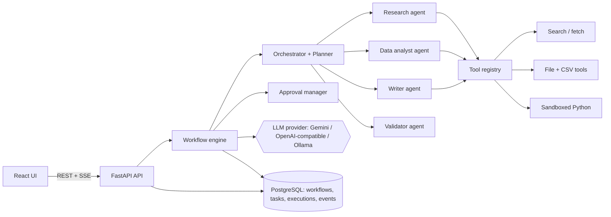
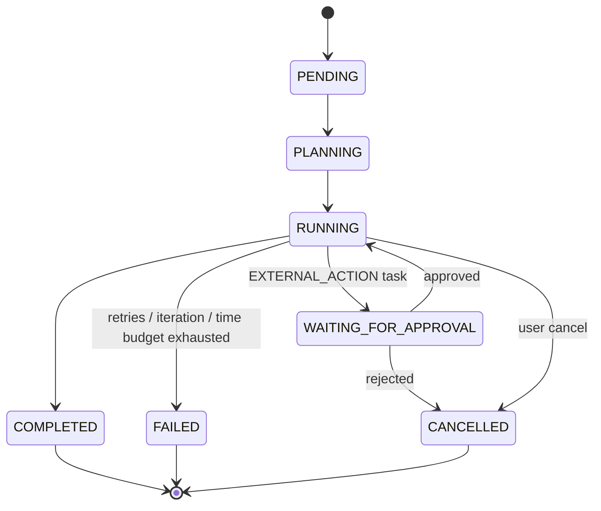
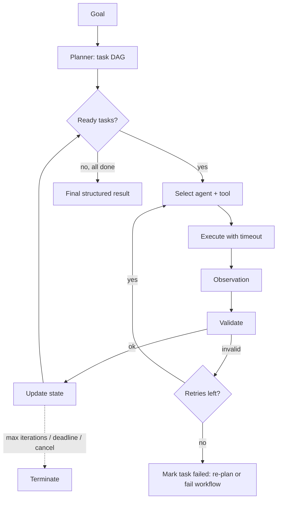

# AgentFlow AI: Architecture and Roadmap

Status: **Phase 1 of 13 complete.** Items marked *(planned)* are NOT implemented yet.
This file is updated at the end of each phase so it never claims more than the code does.

## A. What it is

AgentFlow AI is a platform where a user states an objective ("research topic X and write a report",
"analyze this CSV", "build a report from these documents") and a set of cooperating agents
**plans, acts, observes, validates and recovers** until a structured result is produced, with a
full execution trace and human approval for risky actions.

An agent here is not "an LLM call". It is a loop with state, tools and termination rules:

1. Plan: turn the goal into tasks with dependencies (a DAG).
2. Choose an agent and a tool for each ready task.
3. Execute the tool, capture the observation.
4. Validate the result against a schema and against its evidence.
5. Update state: continue, retry, re-plan, ask for approval, or stop.

## B. Why it is valuable

It exercises the problems real agent systems face: reliability (retries, timeouts, loop limits),
safety (prompt injection, permissioned tools, sandboxing), state persistence, observability and
cost tracking, and **evaluation beyond HTTP 200**.

## C. Target architecture *(planned, except where noted)*

Implemented in Phase 1: UI shell, FastAPI app (config, logging, request IDs, error envelope,
health/readiness), PostgreSQL connection, Alembic wiring, Docker.

### Workflow lifecycle *(planned, Phase 3 and 7)*

### Execution loop with hard limits *(planned, Phase 3)*

## D. Technology stack and reasons

| Area | Choice | Reason |
|---|---|---|
| API | FastAPI, Pydantic v2 | Typed schemas double as agent output contracts |
| DB | PostgreSQL 16, SQLAlchemy 2, Alembic | Durable workflow state; migrations, not startup-created tables |
| Driver | psycopg 3 | Modern driver, binary wheels on Windows |
| Frontend | React, Vite, TypeScript | Standard, fast SPA stack |
| Real-time | SSE (planned) | One-way progress streaming; simpler than WebSockets |
| Orchestration | Own state-machine engine (planned) | Explainable in interviews; no framework black box |
| Background runs | asyncio worker in the API process first (planned) | Simple locally; engine behind an interface so Celery/RQ can replace it |
| LLM | Provider interface: Gemini, OpenAI-compatible, Ollama (planned) | Switch by `LLM_PROVIDER`; free/local options |
| Tests | pytest, httpx TestClient; LLM mocked | No paid calls in tests |
| Quality | Ruff, Black, mypy | Lint, format, types |
| Infra | Docker Compose (db, backend, frontend) | One-command run; Redis only if a queue truly needs it |

### Decisions deferred, with the trade-off stated

- **Web search source (Phase 4).** Candidates: Wikipedia and arXiv APIs (free, no key), and an optional
  Tavily/Brave key. Any tool that fetches URLs needs SSRF protection (block private IPs). Sources are
  only ever reported if a tool actually returned them.
- **Python execution (Phase 4/9).** Windows has no easy process sandbox. Plan: prefer a fixed set of
  whitelisted pandas operations for analysis, and run free-form Python only inside a throwaway Docker
  container (no network, read-only filesystem, memory/time limits). If Docker is unavailable it is disabled.
- **Authentication (Phase 9).** JWT and password hashing; workflow ownership is added by migration.

## E. Roadmap

| Phase | Scope | State |
|---|---|---|
| 1 | Foundation: backend, frontend, DB, Docker, config, health, logging | **done** |
| 2 | Agent framework: BaseAgent, LLM abstraction, structured outputs | not started |
| 3 | Workflow engine: state, task model, DAG, execution loop | not started |
| 4 | Tool system: interface, registry, search, files, CSV, safe Python | not started |
| 5 | Multi-agent: orchestrator, planner, research, data, writer, validator | not started |
| 6 | Memory + persistence | not started |
| 7 | Human-in-the-loop: approvals, pause/resume | not started |
| 8 | Frontend: dashboard, task graph, timeline, live status | not started |
| 9 | Reliability + security: retries, injection defense, permissions, rate limits, auth | not started |
| 10 | Evaluation, metrics, token/cost tracking | not started |
| 11 | Testing: unit, integration, failure injection | not started |
| 12 | Docker production setup + CI/CD | not started |
| 13 | Docs and portfolio polish | not started |

## F. Demo vs production

| Item | Phase 1 | Real production would need |
|---|---|---|
| DB credentials | Dev password in `.env` | Secret manager, managed PostgreSQL, TLS, backups |
| Frontend container | Vite dev server | Static build behind nginx/CDN |
| Background execution | Not built yet | Durable queue and workers with retries |
